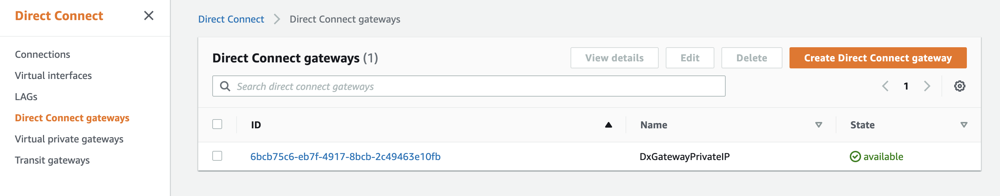
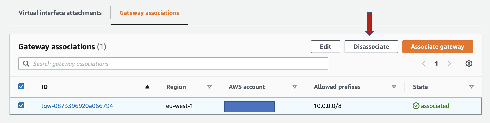

###  Clean up
After completing your demo, delete the 2 AWS CloudFormation Stack created using AWS CDK command:
```
cdk destroy VpnStack

```
In order to continue with the second stack deletion, first disassociate the AWS Transit Gateway from the AWS DirectConnect Gateway:

1. Go to AWS DirectConnect Gateway console

2. Select the AWS DXGW created and go to the *Gateway associations* tab

3. Click on the orange button and Disassociate
4. Once in the Gateway associations tab, the AWS TGW is disassociated (takes 20min aprox.) delete the last stack with the following command:
```
cdk destroy VpnStack
```
## Security


See [CONTRIBUTING](CONTRIBUTING.md#security-issue-notifications) for more information.

## License

This library is licensed under the MIT-0 License. See the LICENSE file.

## Authors
